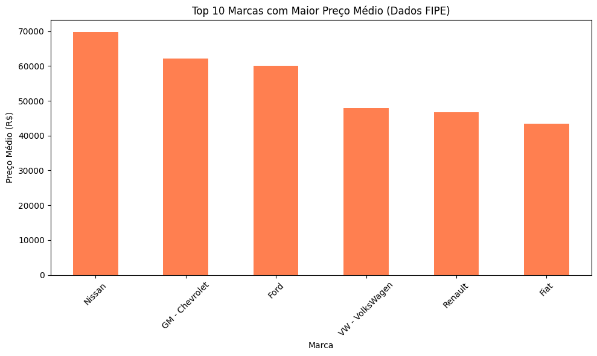
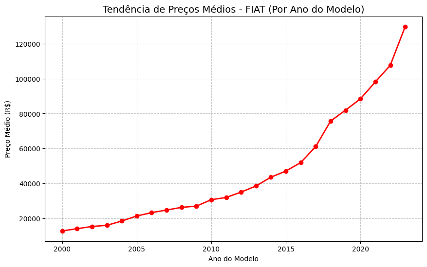
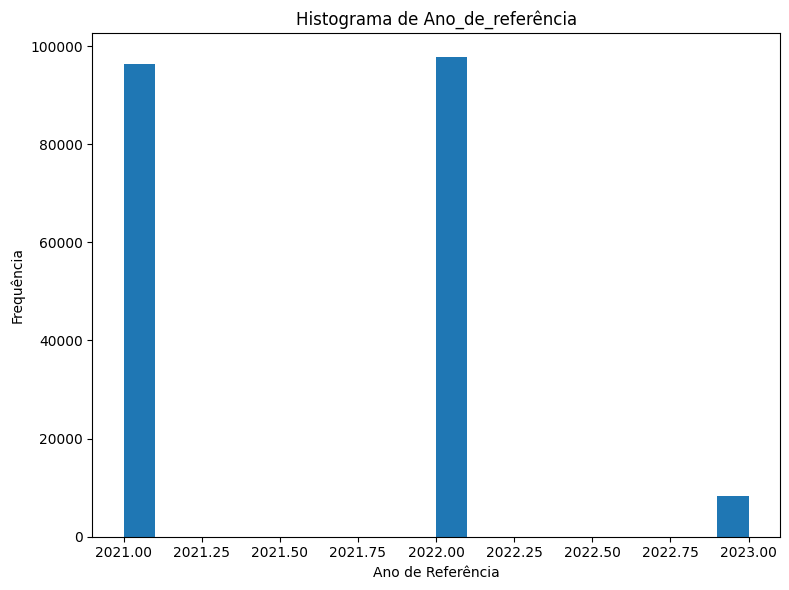

# 🚗 Projeto de Análise de Dados: Mercado Automotivo (FIPE)

Este repositório contém uma análise prática utilizando a biblioteca **Pandas** e **Matplotlib** para explorar dados de preços de carros no Brasil. 

O foco deste projeto é demonstrar a aplicação de diferentes tipos de gráficos para extrair informações valiosas de um arquivo CSV (Tabela FIPE).

---

## 📊 1. Comparação de Preços por Marca (Gráfico de Barras)
Este gráfico utiliza a **média** de preços para comparar diferentes marcas. É a melhor forma de visualizar quais montadoras possuem o maior valor de mercado no estoque.

* **O que ele mostra:** O posicionamento de preço de cada marca.
* **Função principal:** `df.groupby('brand')['avg_price_brl'].mean()`

---

## 📈 2. Tendência de Preço por Ano (Gráfico de Linhas)
Utilizamos o gráfico de linhas para acompanhar a evolução do valor de um modelo específico conforme o seu ano de fabricação aumenta.

* **O que ele mostra:** A curva de valorização do veículo ao longo dos anos.
* **Função principal:** `df.plot(kind='line', x='year_model', y='avg_price_brl')`

---

## 🏔️ 3. Concentração de Valores (Histograma)
O histograma revela a distribuição dos preços. Ele mostra se o conjunto de dados possui mais carros populares, médios ou de luxo.

* **O que ele mostra:** A frequência (quantidade) de carros em cada faixa de preço.
* **Função principal:** `plt.hist(df['avg_price_brl'], bins=30)`

---

## 🛠️ Tecnologias Utilizadas
* **Python 3.x**
* **Pandas**: Para manipulação da base `precos_carros_brasil.csv`.
* **Matplotlib**: Para geração e exportação das imagens.

## 🚀 Como gerar as imagens?
Para que as fotos acima apareçam no seu GitHub, você deve executar o script Python e salvar os arquivos com os nomes:
1. `grafico_barras.png`
2. `grafico_linhas.png`
3. `histograma.png`

E depois fazer o **upload** desses arquivos para a mesma pasta onde está o seu README.md.